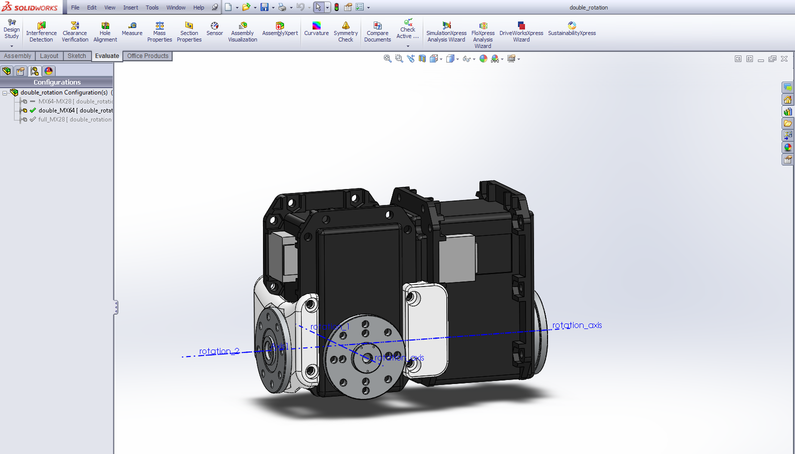

Robotis CAD library
===================

Solidworks library of Robotis CAD models.
It includes the Dynamixel AX-Series and MX/RX-series.

In addition, there are 3D printable parts allowing for compact double rotation assemblies (available for 3 configuration (MX64-MX64, MX64-MX28, MX28-MX28))

 **This work is licensed under a [Creative Commons Attribution-ShareAlike 4.0 International License](http://creativecommons.org/licenses/by-sa/4.0/).**

Please keep references to the Poppy project (www.poppy-project.org) and authors when you use or fork this work.

**Authors:** Matthieu Lapeyre, Alexandre Le Falher.

## Support

You need support ?
The [Poppy forum](https://forum.poppy-project.org/) is the best (and single) place to ask for help!

## Contribute

### /!\ SolidWorks version
The SolidWorks policy sucks, they intentionnaly break compatibility between recent and older version. If you have a Solidworks older than 2013-SP0 you will certainly be able to open these parts but only as a read-only mode, which is equivalent to not beign able to open it...

Therefore, we won't upgrade our SolidWorks so more people can easily modify parts for their own uses.

For the same reason, we ask potential contributors wanting to pull work into official repository to downgrade (if needed) their solidworks version to 2013.

Accepting a pull-request from a Soldiworks >= 2014 will break whole compatibility.

## The Poppy project history

The Poppy project is born in 2012 in the [Flowers laboratory](flowers.inria.fr) at [Inria Bordeaux Sud-Ouest](http://www.inria.fr/en/centre/bordeaux).
It was initiated during [Matthieu Lapeyre](github.com/matthieu-lapeyre)'s PhD Thesis surpervised by [Pierre Yves Oudeyer](http://www.pyoudeyer.com/). At the beginning, the development team was composed by Matthieu Lapeyre (mechanics & design), [Pierre Rouanet](github.com/pierre-rouanet) (software) and [Jonathan Grizou](http://jgrizou.com/) (electronics).

This project is initially a fundamental research project financed by [ERC Grant Explorer](http://erc.europa.eu/) to explore the role of embodiement and morphology properties on cognition and especially on the learning of sensori-motor tasks.
