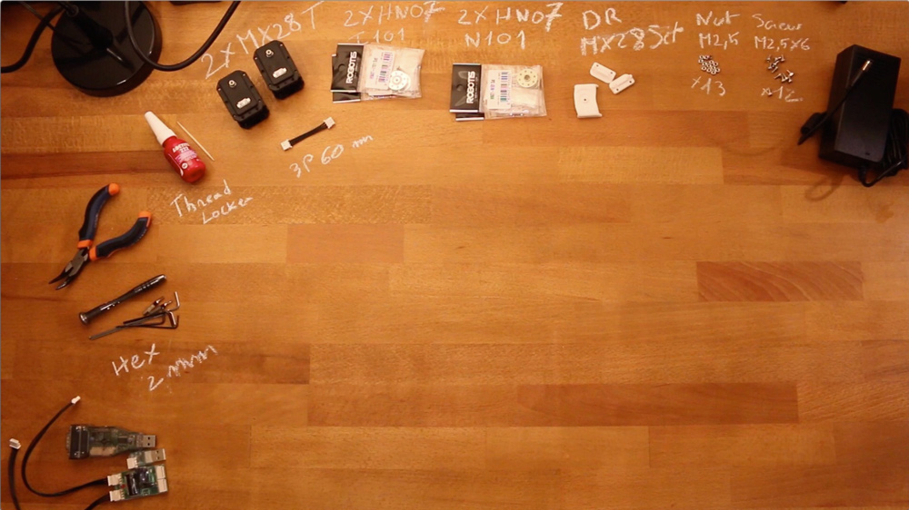

# Double Dynamixel MX-28 AT/R assembly

- Preparation: 5-10 min
- Assembly: 20-25 min

## Requirement:

**3D Printed parts**:
- 1x i101-Set_to_MX28_link
- 2x double_rotation_MX28_link

**Actuators:**
- 2x Robotis Dynamixel MX28-AT

**Cables**:
- 1x 3P 60mm

**Robotis parts:**
- 2x HN07-N101
- 2x HN07-I101
- 13x Nuts M2.5
- 12x Bolts M2.5x6
- 1x Bolts M2.5x8

**Motor configuration:**
- 1x Alimentation 12V
- 1x SMPS2Dynamixel
- 1x USB2Dynamixel or USB2AX
- A computer...

## Assembly instructions:

- **Step 1:** Ensure you have read [**this note**](robotis_trick.md) before continuing to avoid the classic (and critical) traps when using Robotis Dynamixel actuators.
- **Step 2**: Click on the image below to display the video:

