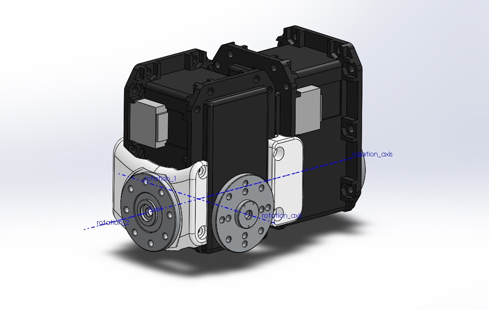
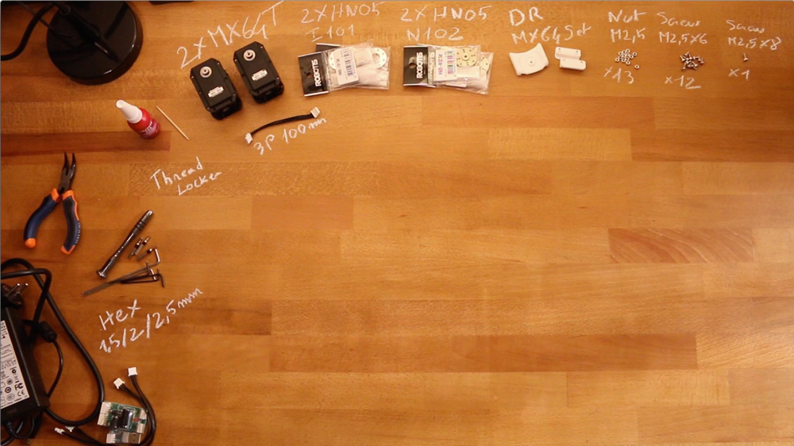

# Assemblage des MX-64 AT/R Double Dynamixel

- Préparation: 105 min
- Assemblage : 20-25 min

## Exigences :

**Parties imprimées en 3D **:
- 1x i101-Set_to_MX64_link
- 2x double_rotation_MX64_link

**Actionneurs :**
- 2x Robotis Dynamixel MX64-AT

**Câbles **:
- 1x 3P 100mm

**Parties Robotis :**
- 2x HN05-N102
- 2x HN05-I101
- 13x écrous M2.5
- 12x vis M2.5x6
- 1x vis M2.5x8

**Motor configuration:**
- 1x Alimentation 12V
- 1x SMPS2Dynamixel
- 1x USB2Dynamixel or USB2AX
- Un ordinateur...

## Instruction d'assemblage :

- **Etape 1:** Assurez-vous d'avoir lu [**cette note**](robotis_tricks.md) avant de continuer pour éviter les pièges classiques (et critiques) dans l'utilisation des actionneurs Robotis Dynamixel.
- **Etape 2**: Cliquez sur l'image ci-dessous pour afficher la vidéo :

